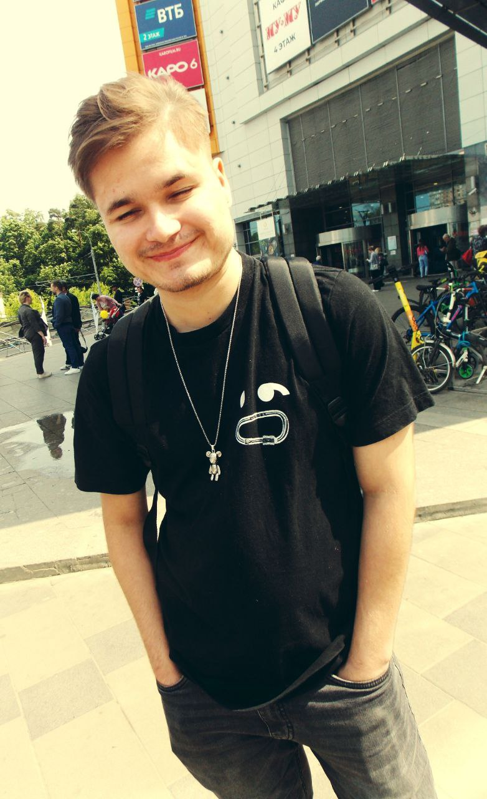

# Привет, мир!

## Обо мне
Всем привет! Меня зовут Евгений, мне 20 лет, и я учусь в Нетологии, чтобы стать Python-разработчиком. 

**Образование**
Неоконченное высшее: Московский технический университет связи и информатики(2026)

## Мои текущие навыки

**Python**
- Циклы
- Условные конструкции
- Списки
- Кортежи
- Словари
- Множества
- Функции
  
**Git**
  - Создание репозиториев
  - Коммиты
  - Командная разработка: GitHub, issues, pull requests, git pull
  

**Языки**
- Английский(A2)
- Французский(B2)

## Мои будущие навыки

**Python**
- Парадигма ООП
- Файловая система
- API 
  
**Базы данных**
- PosgreSQL
- ORM

**Фреймворки**
- Django 

## Контакты

Моя почта: [ilonsisse@yandex.ru](mailto:ilonsisse@yandex.ru)